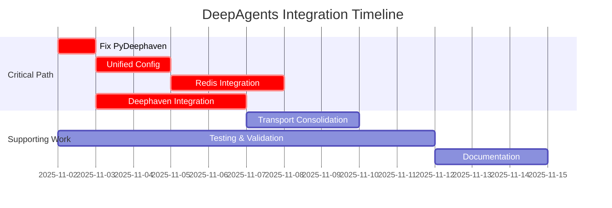

# DeepAgents Integration Master Plan
## Post-Merge Consolidation & Enhancement

**Created:** November 2, 2025  
**Status:** In Progress  
**Priority:** P0 - Critical Path

---

## Executive Summary

This document outlines the comprehensive integration strategy for consolidating the `deepagents-enhancements` merge into a cohesive, production-ready framework. The merge brought together three major architectural components:

1. **Deephaven Neural Bus** - Real-time message transport and telemetry
2. **Redis Memory System** - Short/long-term memory with state persistence
3. **Core DeepAgents** - LangGraph-based agent orchestration

These components were designed separately and require meticulous integration to function as a unified system.

---

## Critical Issues Identified

### 1. **PyDeephaven Import Errors** (BLOCKING)
- **Status:** 🔴 Critical
- **Issue:** `cannot import name 'dtypes' from 'pydeephaven'`
- **Location:** `src/deepagents/telemetry/deephaven.py:14`
- **Impact:** All Deephaven functionality is broken; tests fail on import
- **Root Cause:** PyDeephaven API changed between versions; `dtypes` module location/structure differs

### 2. **Incomplete Configuration Integration**
- **Status:** 🟡 High Priority
- **Issue:** Missing unified configuration for Deephaven + Redis coordination
- **Impact:** Cannot initialize both systems simultaneously with coherent settings

### 3. **Memory System Not Connected**
- **Status:** 🟡 High Priority  
- **Issue:** Redis memory system exists but not wired into graph execution
- **Impact:** No persistence of agent state, todos, or filesystem operations

### 4. **Transport Layer Fragmentation**
- **Status:** 🟡 Medium Priority
- **Issue:** Multiple transport implementations (memory, deephaven_bus, deephaven_transport) with unclear responsibilities
- **Impact:** Confusing API surface; unclear which transport to use when

---

## Integration Workstreams

### **WORKSTREAM 1: Fix PyDeephaven Compatibility**
**Owner:** TBD  
**Timeline:** Immediate (Day 1)  
**Blockers:** None

#### Tasks:
- [ ] **TASK-001:** Investigate PyDeephaven 0.39.8 API structure
  - Research correct import paths for dtypes module
  - Check if module was moved, renamed, or replaced
  - Review PyDeephaven changelog and migration guides
  - Document API differences between 0.32.x and 0.38.x+

- [ ] **TASK-002:** Fix telemetry/deephaven.py imports
  - Update import statements to match current PyDeephaven API
  - Add version-specific compatibility shims if needed
  - Ensure fallback behavior works when PyDeephaven unavailable
  - Test with actual Deephaven server connection

- [ ] **TASK-003:** Fix transports/deephaven_*.py imports
  - Audit all Deephaven-related files for import issues
  - Update schema definitions to use correct dtype references
  - Ensure table creation scripts use valid column types
  - Test table bootstrapping end-to-end

- [ ] **TASK-004:** Update dependency constraints
  - Pin PyDeephaven to tested version range
  - Document minimum/maximum supported versions
  - Add dependency conflict resolution notes
  - Update lockfile with `uv lock`

**Success Criteria:**
- All tests pass without import errors
- Deephaven telemetry emitter can connect and write data
- Transport layer can publish/subscribe to Deephaven tables

---

### **WORKSTREAM 2: Unified Configuration Architecture**
**Owner:** TBD  
**Timeline:** Days 2-3  
**Blockers:** TASK-004

#### Tasks:
- [ ] **TASK-101:** Design unified settings schema
  - Create `AgentSystemConfig` dataclass encompassing:
    - Redis settings (connection, pool size, timeouts)
    - Deephaven settings (host, port, auth, tables)
    - Feature flags (enable_redis_cache, enable_deephaven_telemetry, etc.)
    - Workspace/namespace configuration
  - Support environment variable overrides
  - Support YAML/JSON config file loading
  - Add validation and sensible defaults

- [ ] **TASK-102:** Implement config loading infrastructure
  - Create `deepagents/config/__init__.py` with unified loader
  - Support cascading config sources (env vars > files > defaults)
  - Add schema validation with helpful error messages
  - Implement config merging for partial overrides

- [ ] **TASK-103:** Wire config into `create_deep_agent`
  - Extend `create_deep_agent` to accept `AgentSystemConfig`
  - Auto-initialize Redis client when redis_settings provided
  - Auto-initialize Deephaven session when deephaven_settings provided
  - Pass config to all middleware constructors

- [ ] **TASK-104:** Update documentation
  - Write configuration guide with examples
  - Document all config options with types and defaults
  - Provide deployment templates (dev, staging, prod)
  - Add troubleshooting section for common config issues

**Success Criteria:**
- Single source of truth for all system configuration
- Clear precedence rules for config sources
- Zero-config development experience (all features work with defaults)
- Production-ready config templates provided

---

### **WORKSTREAM 3: Redis Memory Integration**
**Owner:** TBD  
**Timeline:** Days 3-5  
**Blockers:** TASK-103

#### Tasks:
- [ ] **TASK-201:** Implement Redis-backed TODO persistence
  - Create `RedisTodoStore` wrapping Redis sorted sets
  - Implement atomic CRUD operations using Lua scripts
  - Add optimistic locking with version counters
  - Support priority-based ordering and filtering

- [ ] **TASK-202:** Wire Redis todos into TodoListMiddleware
  - Modify TodoListMiddleware to use pluggable storage backend
  - Add storage adapter protocol/interface
  - Implement dual-write mode for migration (memory + Redis)
  - Add read-through cache for performance

- [ ] **TASK-203:** Implement Redis-backed filesystem
  - Create `RedisFilesystemBackend` implementing storage protocol
  - Support chunked file uploads for large files
  - Add metadata tracking (checksums, versions, timestamps)
  - Implement TTL-based eviction for temp files

- [ ] **TASK-204:** Wire Redis filesystem into FilesystemMiddleware
  - Add backend selection logic to FilesystemMiddleware
  - Support fallback chain (Redis → disk → S3)
  - Implement streaming reads/writes for large files
  - Add cache warming strategies

- [ ] **TASK-205:** Implement Redis pub/sub for coordination
  - Create event bus using Redis pub/sub
  - Define event schema (todo.created, file.updated, etc.)
  - Add subscription management and filtering
  - Implement reconnection and replay logic

- [ ] **TASK-206:** Add observability and metrics
  - Track cache hit rates for todos and files
  - Monitor Redis connection pool health
  - Emit latency metrics for Redis operations
  - Add alerts for degraded performance

**Success Criteria:**
- Todos persist across agent restarts
- Files survive process crashes
- Multi-agent coordination via pub/sub events
- <5ms p95 latency for Redis operations
- Graceful degradation when Redis unavailable

---

### **WORKSTREAM 4: Deephaven Neural Bus Integration**
**Owner:** TBD  
**Timeline:** Days 4-7  
**Blockers:** TASK-002, TASK-103

#### Tasks:
- [ ] **TASK-301:** Bootstrap Deephaven table schemas
  - Create `deepagents/scripts/deephaven_bootstrap.py`
  - Implement idempotent table creation for:
    - `agent_messages` (message queue with leasing)
    - `agent_events` (audit log)
    - `agent_metrics` (aggregated metrics)
  - Add index creation for common queries
  - Support multiple update graphs for isolation

- [ ] **TASK-302:** Complete DeephavenBus implementation
  - Finish `DeephavenBus.publish_message()` using TablePublisher
  - Implement `DeephavenBus.subscribe_messages()` with filtering
  - Add lease-based message claiming (optimistic locking)
  - Implement ack/nack/extend_lease operations
  - Add backpressure and queue depth monitoring

- [ ] **TASK-303:** Integrate telemetry emitter
  - Wire `DeephavenTelemetryEmitter` into agent graph
  - Emit lifecycle events (agent.started, tool.called, etc.)
  - Emit performance metrics (latency, token usage, etc.)
  - Add configurable batching and flush policies

- [ ] **TASK-304:** Build observability dashboards
  - Create Deephaven queries for live metrics
  - Build dashboard showing:
    - Message queue backlog
    - Agent processing rates
    - Error rates by agent/tool
    - Token usage trends
  - Export to Prometheus/Grafana if needed

- [ ] **TASK-305:** Add Kafka bridge (optional)
  - Configure Deephaven→Kafka connector
  - Mirror critical tables for durability
  - Support replay from Kafka for disaster recovery
  - Document operational procedures

**Success Criteria:**
- Messages flow through Deephaven with <100ms latency
- No message loss under normal operation
- Observability dashboards provide actionable insights
- System scales to 100+ messages/second

---

### **WORKSTREAM 5: Transport Layer Consolidation**
**Owner:** TBD  
**Timeline:** Days 5-7  
**Blockers:** TASK-302

#### Tasks:
- [ ] **TASK-401:** Define canonical transport interface
  - Create `deepagents/transports/protocol.py` with:
    - `TransportProtocol` (publish/subscribe interface)
    - `MessageEnvelope` (standard message format)
    - `SubscriptionHandle` (lifecycle management)
  - Document semantics (at-least-once, ordering guarantees, etc.)

- [ ] **TASK-402:** Refactor existing transports
  - Update `InMemoryTransport` to implement protocol
  - Update `DeephavenBus` to implement protocol
  - Deprecate redundant transport implementations
  - Add adapter layer for backward compatibility

- [ ] **TASK-403:** Add transport selection logic
  - Implement `create_transport()` factory function
  - Support transport selection via config
  - Add auto-detection based on available services
  - Provide sensible defaults (memory → Deephaven → Redis)

- [ ] **TASK-404:** Write integration tests
  - Test message flow across all transport types
  - Verify subscription filtering works correctly
  - Test reconnection and failure recovery
  - Benchmark performance characteristics

**Success Criteria:**
- Single, well-documented transport interface
- Easy to swap transports without code changes
- Clear migration path from old to new API
- Performance parity or better than original implementations

---

### **WORKSTREAM 6: Testing & Validation**
**Owner:** TBD  
**Timeline:** Ongoing (Days 1-10)  
**Blockers:** All prior tasks

#### Tasks:
- [ ] **TASK-501:** Fix existing test suite
  - Resolve all import errors in tests
  - Update test fixtures for new config system
  - Add mocks for Redis/Deephaven when unavailable
  - Ensure all unit tests pass

- [ ] **TASK-502:** Add integration tests
  - Test Redis + Deephaven working together
  - Test full agent lifecycle with all features enabled
  - Test failure modes (Redis down, Deephaven down, both down)
  - Test migration from memory to Redis/Deephaven

- [ ] **TASK-503:** Add performance benchmarks
  - Measure baseline performance (memory-only)
  - Measure Redis-backed performance
  - Measure Deephaven-backed performance
  - Measure combined performance
  - Document overhead and bottlenecks

- [ ] **TASK-504:** Add end-to-end scenarios
  - Multi-agent collaboration scenario
  - Long-running agent with persistence
  - High-throughput message processing
  - Disaster recovery and replay

- [ ] **TASK-505:** Set up CI/CD
  - Configure GitHub Actions for automated testing
  - Add Docker Compose for Redis/Deephaven in CI
  - Implement smoke tests for quick validation
  - Add nightly performance regression tests

**Success Criteria:**
- 100% of unit tests passing
- 95%+ code coverage on new code
- All integration tests passing
- Performance within 10% of baseline
- CI pipeline green on every commit

---

### **WORKSTREAM 7: Documentation & Examples**
**Owner:** TBD  
**Timeline:** Days 8-10  
**Blockers:** TASK-501, TASK-502

#### Tasks:
- [ ] **TASK-601:** Update architecture documentation
  - Create unified architecture diagram showing all components
  - Document data flows (Redis, Deephaven, LangGraph)
  - Explain design decisions and trade-offs
  - Add sequence diagrams for key operations

- [ ] **TASK-602:** Write user guides
  - Getting started guide with all features
  - Configuration guide (detailed)
  - Deployment guide (local, Docker, K8s)
  - Troubleshooting guide

- [ ] **TASK-603:** Write operator guides
  - Redis operations (backup, restore, scaling)
  - Deephaven operations (monitoring, tuning)
  - Monitoring and alerting setup
  - Disaster recovery procedures

- [ ] **TASK-604:** Create comprehensive examples
  - Simple agent (memory-only)
  - Redis-backed agent (persistence)
  - Deephaven-backed agent (observability)
  - Multi-agent system (full stack)
  - Production deployment example

- [ ] **TASK-605:** Update API documentation
  - Generate API docs from docstrings
  - Add usage examples to all public APIs
  - Document all configuration options
  - Add migration guide from 0.2.x to 0.3.0

**Success Criteria:**
- New users can get started in <15 minutes
- All features have working examples
- Operators can deploy to production confidently
- API docs are complete and accurate

---

## Dependencies & Timeline

**Estimated Total Duration:** 10-12 business days

---

## Risk Register

| Risk | Probability | Impact | Mitigation |
|------|------------|--------|------------|
| PyDeephaven API incompatible | High | Critical | Pin to known-good version; contribute fixes upstream |
| Redis performance degradation | Medium | High | Implement caching; tune connection pool; load test early |
| Deephaven connection instability | Medium | Medium | Add circuit breakers; implement retry logic; fallback to memory |
| Config complexity overwhelming users | High | Medium | Provide sensible defaults; wizard for common setups |
| Integration bugs from separate designs | High | High | Comprehensive testing; phased rollout with feature flags |
| Timeline slippage | Medium | Medium | Daily standups; task parallelization; scope reduction if needed |

---

## Success Metrics

### Technical Metrics
- ✅ All tests passing (100% unit, 95% integration)
- ✅ No critical bugs in issue tracker
- ✅ Performance within 10% of baseline
- ✅ Code coverage >80% on new code

### Operational Metrics
- ✅ Documentation complete for all features
- ✅ Deployment guides tested and validated
- ✅ Runbooks created for common issues
- ✅ Monitoring dashboards operational

### User Metrics
- ✅ Getting started time <15 minutes
- ✅ Example applications run successfully
- ✅ API surface is intuitive and consistent
- ✅ Migration path from 0.2.x is clear

---

## Next Steps

1. **Assign owners** to each workstream
2. **Create GitHub issues** for all tasks with TASK-XXX labels
3. **Set up project board** for tracking progress
4. **Schedule daily standups** for coordination
5. **Begin TASK-001** immediately (PyDeephaven fix)

---

## Notes

- This plan assumes full-time dedication from 2-3 engineers
- Tasks can be parallelized across workstreams
- Feature flags enable incremental rollout
- All work should be done on feature branches with PR reviews
- Integration testing should happen continuously, not just at the end

---

**Document Version:** 1.0  
**Last Updated:** 2025-11-02  
**Next Review:** 2025-11-04

